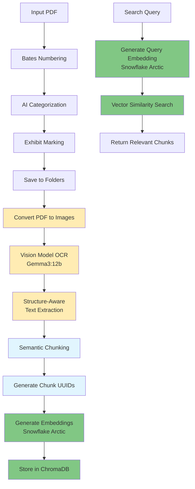

# Context 4: Vector Search Implementation with Vision-Based Text Extraction

## Overview
This document outlines the implementation plan for adding vector search capabilities to the Bates Numbering & Exhibit Marking Tool. The enhancement will enable semantic search across processed legal documents by using vision-based OCR for text extraction, intelligent chunking, generating embeddings using Ollama, and storing them in a lightweight vector database.

## Implementation Goals
1. **Vision-Based Text Extraction**: Use Gemma3:12b vision model for accurate OCR and layout-aware text extraction
2. **Intelligent Document Chunking**: Split extracted text into semantic chunks optimized for legal documents
3. **Local Embeddings**: Use Snowflake Arctic Embed model for high-quality vectorization
4. **Simple Vector Storage**: Implement ChromaDB for minimal configuration vector storage
5. **Seamless Integration**: Add vector capabilities without disrupting existing workflow
6. **Fast Retrieval**: Enable quick semantic search across all processed documents

## Architecture Design

### Enhanced Processing Flow with Vision-Based Extraction



### Data Flow Details

```mermaid
graph LR
    subgraph "Vision-Based Processing"
        A1[PDF Page] --> A2[Convert to Image<br/>300 DPI]
        A2 --> A3[Gemma3:12b OCR]
        A3 --> A4[Structured Text<br/>with Layout Info]
    end
    
    subgraph "Text Processing"
        B1[OCR Output] --> B2[Clean & Format]
        B2 --> B3[Semantic Chunking<br/>750-1000 tokens]
        B3 --> B4[Chunk Metadata]
    end
    
    subgraph "Vector Storage"
        C1[Chunk Text] --> C2[Snowflake Arctic<br/>Embeddings]
        C2 --> C3[768-dim Vector]
        C3 --> C4[ChromaDB]
        C4 --> C5[Metadata Index]
    end
    
    A4 --> B1
    B4 --> C1
```



## Technical Components

### 1. Vision-Based Text Extraction with Gemma3:12b

```python
import pdf2image
import ollama
import base64
from typing import List, Dict
import json

class VisionOCRExtractor:
    def __init__(self, model="gemma3:12b", dpi=300):
        """
        Vision-based text extraction using Gemma3:12b
        - model: Ollama vision model for OCR
        - dpi: Resolution for PDF to image conversion
        """
        self.model = model
        self.dpi = dpi
        self.client = ollama.Client()
        
    def extract_text_from_pdf(self, pdf_path: str) -> List[Dict]:
        """Extract text from PDF using vision model"""
        # Convert PDF pages to images
        images = pdf2image.convert_from_path(pdf_path, dpi=self.dpi)
        
        extracted_pages = []
        for page_num, image in enumerate(images, 1):
            # Convert image to base64
            img_buffer = io.BytesIO()
            image.save(img_buffer, format='PNG')
            img_base64 = base64.b64encode(img_buffer.getvalue()).decode()
            
            # Prompt for structured extraction
            prompt = """Extract all text from this legal document image. 
            Return the text in a JSON format that preserves:
            1. Document structure (headers, paragraphs, lists)
            2. Any tables or structured data
            3. Page numbers, footnotes, or citations
            4. Layout information that aids semantic chunking
            
            Format:
            {
                "headers": ["header1", "header2"],
                "paragraphs": ["para1", "para2"],
                "tables": [{"rows": [...]}],
                "footnotes": ["footnote1"],
                "page_elements": {...}
            }
            """
            
            response = self.client.generate(
                model=self.model,
                prompt=prompt,
                images=[img_base64],
                options={"temperature": 0.1}  # Low temp for accuracy
            )
            
            # Parse structured response
            try:
                structured_text = json.loads(response['response'])
            except:
                # Fallback to plain text
                structured_text = {"raw_text": response['response']}
            
            extracted_pages.append({
                "page_num": page_num,
                "content": structured_text,
                "image_size": image.size
            })
            
        return extracted_pages

class SemanticChunker:
    def __init__(self, chunk_size=750, chunk_overlap=150):
        """
        Intelligent chunking based on document structure
        """
        self.chunk_size = chunk_size
        self.chunk_overlap = chunk_overlap
    
    def chunk_extracted_text(self, extracted_pages: List[Dict]) -> List[Dict]:
        """Create semantic chunks from vision-extracted text"""
        chunks = []
        
        for page_data in extracted_pages:
            content = page_data['content']
            page_num = page_data['page_num']
            
            # Process based on structure
            if 'paragraphs' in content:
                # Smart paragraph-based chunking
                for i, para in enumerate(content['paragraphs']):
                    chunks.append({
                        'text': para,
                        'page': page_num,
                        'type': 'paragraph',
                        'index': i
                    })
            elif 'raw_text' in content:
                # Fallback chunking for unstructured text
                text = content['raw_text']
                # Use RecursiveCharacterTextSplitter or similar
                # Implementation here...
```

### 2. ChromaDB Vector Storage Implementation

```python
import chromadb
from chromadb.config import Settings

class ChromaVectorStore:
    def __init__(self, path="./output/vector_store"):
        """
        ChromaDB setup optimized for legal document search
        - Persistent storage with SQLite + Parquet
        - 768-dimensional vectors from Snowflake Arctic
        """
        self.client = chromadb.PersistentClient(
            path=path,
            settings=Settings(
                anonymized_telemetry=False,
                allow_reset=True
            )
        )
        
        # Create or get collection
        try:
            self.collection = self.client.create_collection(
                name="legal_documents",
                metadata={
                    "hnsw:space": "cosine",
                    "hnsw:construction_ef": 200,
                    "hnsw:M": 16
                }
            )
        except:
            self.collection = self.client.get_collection("legal_documents")
    
    def add_chunks(self, chunks: List[Dict], embeddings: List[List[float]]):
        """Store chunks with their embeddings and metadata"""
        ids = [chunk['id'] for chunk in chunks]
        documents = [chunk['text'] for chunk in chunks]
        metadatas = [{
            'source_pdf': chunk['source_pdf'],
            'page': chunk['page'],
            'chunk_index': chunk['index'],
            'bates_start': chunk['bates_start'],
            'bates_end': chunk['bates_end'],
            'category': chunk['category'],
            'exhibit_number': chunk['exhibit_number'],
            'extraction_method': 'gemma3_vision_ocr'
        } for chunk in chunks]
        
        self.collection.add(
            ids=ids,
            embeddings=embeddings,
            documents=documents,
            metadatas=metadatas
        )
```

### 3. Snowflake Arctic Embedding Integration

```python
class SnowflakeArcticEmbedder:
    def __init__(self, model="snowflake-arctic-embed:335m", host="http://localhost:11434"):
        """
        Snowflake Arctic Embed model for high-quality embeddings
        - snowflake-arctic-embed:335m: 768 dimensions, state-of-the-art quality
        - Optimized for retrieval tasks
        - Excellent performance on legal/technical text
        """
        self.model = model
        self.client = ollama.Client(host=host)
        self.dimension = 768
    
    def embed_text(self, text: str) -> List[float]:
        """Generate embedding for a single text"""
        response = self.client.embeddings(
            model=self.model,
            prompt=text
        )
        return response['embedding']
    
    def embed_batch(self, texts: List[str], batch_size=10) -> List[List[float]]:
        """Batch embed multiple texts for efficiency"""
        embeddings = []
        for i in range(0, len(texts), batch_size):
            batch = texts[i:i + batch_size]
            batch_embeddings = [self.embed_text(text) for text in batch]
            embeddings.extend(batch_embeddings)
        return embeddings
```

## Implementation Plan

### Phase 1: Core Infrastructure (3-4 hours)

1. **Add Dependencies**
```txt
# requirements.txt additions
chromadb>=0.4.0           # Vector database
pdf2image>=1.16.0         # PDF to image conversion
pillow>=10.0.0           # Image processing
langchain-text-splitters>=0.0.1  # Advanced chunking
```

2. **Create Vector Processing Module** (`src/vector_processor.py`)
```python
import uuid
import logging
import io
from typing import List, Dict, Tuple
from langchain_text_splitters import RecursiveCharacterTextSplitter
from src.config import VECTOR_STORE_PATH, EMBEDDING_MODEL, VISION_MODEL

logger = logging.getLogger(__name__)

class VectorProcessor:
    def __init__(self):
        # Initialize components
        self.vision_extractor = VisionOCRExtractor(model=VISION_MODEL)
        self.embedder = SnowflakeArcticEmbedder(model=EMBEDDING_MODEL)
        self.vector_store = ChromaVectorStore(path=VECTOR_STORE_PATH)
        self.chunker = SemanticChunker()
        
        # Fallback text splitter for unstructured content
        self.text_splitter = RecursiveCharacterTextSplitter(
            chunk_size=750,
            chunk_overlap=150,
            separators=["\n\n", "\n", ". ", " ", ""]
        )
    
    def process_document(self, pdf_path: str, metadata: Dict) -> List[str]:
        """Process a PDF into vectorized chunks using vision OCR"""
        try:
            logger.info(f"Starting vision-based extraction for {pdf_path}")
            
            # Step 1: Extract text using vision model
            extracted_pages = self.vision_extractor.extract_text_from_pdf(pdf_path)
            
            # Step 2: Create semantic chunks
            chunks = self._create_chunks(extracted_pages, metadata)
            
            # Step 3: Generate embeddings
            chunk_texts = [chunk['text'] for chunk in chunks]
            embeddings = self.embedder.embed_batch(chunk_texts)
            
            # Step 4: Store in ChromaDB
            self.vector_store.add_chunks(chunks, embeddings)
            
            chunk_ids = [chunk['id'] for chunk in chunks]
            logger.info(f"Successfully processed {len(chunk_ids)} chunks from {pdf_path}")
            
            return chunk_ids
            
        except Exception as e:
            logger.error(f"Error processing {pdf_path}: {str(e)}")
            raise
    
    def _create_chunks(self, extracted_pages: List[Dict], metadata: Dict) -> List[Dict]:
        """Create chunks from vision-extracted pages"""
        chunks = []
        chunk_index = 0
        
        for page_data in extracted_pages:
            page_num = page_data['page_num']
            content = page_data['content']
            
            # Extract text based on structure
            if 'paragraphs' in content:
                # Structured extraction
                for para in content['paragraphs']:
                    if len(para.strip()) > 50:  # Skip very short paragraphs
                        chunks.append({
                            'id': str(uuid.uuid4()),
                            'text': para,
                            'page': page_num,
                            'index': chunk_index,
                            **metadata
                        })
                        chunk_index += 1
                        
            elif 'raw_text' in content:
                # Fallback to text splitting
                page_text = content['raw_text']
                text_chunks = self.text_splitter.split_text(page_text)
                
                for text_chunk in text_chunks:
                    chunks.append({
                        'id': str(uuid.uuid4()),
                        'text': text_chunk,
                        'page': page_num,
                        'index': chunk_index,
                        **metadata
                    })
                    chunk_index += 1
                    
            # Handle tables separately if present
            if 'tables' in content:
                for table in content['tables']:
                    table_text = self._format_table(table)
                    chunks.append({
                        'id': str(uuid.uuid4()),
                        'text': table_text,
                        'page': page_num,
                        'index': chunk_index,
                        'type': 'table',
                        **metadata
                    })
                    chunk_index += 1
        
        return chunks
    
    def _format_table(self, table_data: Dict) -> str:
        """Format table data into searchable text"""
        # Implementation for table formatting
        return str(table_data)  # Placeholder
```

### Phase 2: Integration with Main Pipeline (1-2 hours)

1. **Update Configuration** (`src/config.py`)
```python
# Vector Search Configuration
ENABLE_VECTOR_SEARCH = os.getenv("ENABLE_VECTOR_SEARCH", "true").lower() == "true"
VECTOR_STORE_PATH = os.path.join(OUTPUT_DIR, "vector_store")
VISION_MODEL = os.getenv("OLLAMA_VISION_MODEL", "gemma3:12b")
EMBEDDING_MODEL = os.getenv("OLLAMA_EMBEDDING_MODEL", "snowflake-arctic-embed:335m")
CHUNK_SIZE = int(os.getenv("CHUNK_SIZE", "750"))
CHUNK_OVERLAP = int(os.getenv("CHUNK_OVERLAP", "150"))
PDF_DPI = int(os.getenv("PDF_DPI", "300"))  # DPI for PDF to image conversion
```

2. **Modify Main Processing** (`src/main.py`)
```python
# After exhibit marking and saving
if ENABLE_VECTOR_SEARCH and vector_processor:
    try:
        chunk_ids = vector_processor.process_document(
            exhibit_output_path,
            {
                "filename": filename,
                "category": category,
                "exhibit_number": exhibit_number,
                "bates_start": current_bates,
                "bates_end": current_bates + num_pages - 1,
                "summary": summary,
                "processed_date": datetime.now().isoformat()
            }
        )
        logger.info(f"Created {len(chunk_ids)} vector chunks for {filename}")
    except Exception as e:
        logger.error(f"Vector processing failed for {filename}: {e}")
        # Continue processing other documents
```

### Phase 3: Search Interface (1-2 hours)

1. **Create Search Module** (`src/vector_search.py`)
```python
class VectorSearcher:
    def __init__(self):
        self.client = chromadb.PersistentClient(path=VECTOR_STORE_PATH)
        self.collection = self.client.get_collection("legal_documents")
        self.embedder = OllamaEmbedder(model=EMBEDDING_MODEL)
    
    def search(self, query: str, n_results: int = 10) -> List[Dict]:
        """Semantic search across all documents"""
        query_embedding = self.embedder.embed_text(query)
        
        results = self.collection.query(
            query_embeddings=[query_embedding],
            n_results=n_results,
            include=["documents", "metadatas", "distances"]
        )
        
        return self._format_results(results)
    
    def search_by_category(self, query: str, category: str, n_results: int = 5):
        """Search within a specific document category"""
        results = self.collection.query(
            query_embeddings=[self.embedder.embed_text(query)],
            n_results=n_results,
            where={"category": category},
            include=["documents", "metadatas", "distances"]
        )
        return self._format_results(results)
```

2. **CLI Search Tool** (`src/search_cli.py`)
```python
#!/usr/bin/env python3
"""Command-line search interface for vectorized legal documents"""

import argparse
from src.vector_search import VectorSearcher

def main():
    parser = argparse.ArgumentParser(description="Search legal documents")
    parser.add_argument("query", help="Search query")
    parser.add_argument("-n", "--num-results", type=int, default=5)
    parser.add_argument("-c", "--category", help="Filter by category")
    
    args = parser.parse_args()
    
    searcher = VectorSearcher()
    
    if args.category:
        results = searcher.search_by_category(
            args.query, args.category, args.num_results
        )
    else:
        results = searcher.search(args.query, args.num_results)
    
    # Display results
    for i, result in enumerate(results, 1):
        print(f"\n--- Result {i} ---")
        print(f"Document: {result['filename']}")
        print(f"Category: {result['category']}")
        print(f"Bates: {result['bates_start']}-{result['bates_end']}")
        print(f"Relevance: {result['relevance']:.2%}")
        print(f"Excerpt: {result['text'][:200]}...")

if __name__ == "__main__":
    main()
```

## Storage Structure

```
output/
├── bates_numbered/         # Existing Bates-stamped PDFs
├── exhibits/              # Existing exhibit-marked PDFs
├── exhibit_log.csv        # Existing processing log
└── vector_store/          # New vector database
    ├── chroma.sqlite3     # Vector index & metadata
    └── embeddings/        # Parquet files with vectors
```

## Usage Examples

### Basic Document Processing
```bash
# Process documents with vector indexing
python src/main.py

# Output includes:
# ✅ Processed document_1.pdf (15 pages)
# 📸 Vision OCR: Extracted structured text from 15 pages
# 📝 Created 42 semantic chunks
# 🔢 Generated embeddings with Snowflake Arctic
# 💾 Stored in ChromaDB vector store
```

### Semantic Search
```bash
# Search across all documents
python src/search_cli.py "motion to dismiss statute of limitations"

# Search within category
python src/search_cli.py "patient treatment plan" --category "Medical Record"

# Get more results
python src/search_cli.py "insurance coverage" -n 10
```

### Model Setup
```bash
# Pull required Ollama models
ollama pull gemma3:12b                    # Vision model for OCR
ollama pull snowflake-arctic-embed:335m   # Embedding model
```

## Performance Considerations

### Vision OCR Processing
- **Speed**: ~2-5 seconds per page with Gemma3:12b
- **GPU Acceleration**: Highly recommended for vision models
- **Batch Processing**: Process multiple pages concurrently where possible
- **Accuracy**: Superior to traditional OCR, especially for:
  - Complex layouts
  - Tables and forms
  - Handwritten annotations
  - Poor quality scans

### Embedding Generation
- **Speed**: ~0.2-0.4 seconds per chunk with Snowflake Arctic
- **Batch Processing**: Process 10-20 chunks at once
- **Model Quality**: 768-dimensional embeddings provide excellent retrieval accuracy

### Storage Requirements
- **Vector Size**: ~3KB per chunk (768 dimensions)
- **Metadata**: ~0.5KB per chunk
- **Image Cache**: ~1MB per PDF page (temporary, can be cleared)
- **Example**: 1000 documents → ~30,000 chunks → ~105MB total

### Search Performance
- **ChromaDB**: <100ms for 100k chunks
- **Scaling**: Consider distributed solutions for >1M chunks

## Security & Privacy

1. **Local Processing**: All embeddings generated on-premise
2. **No External APIs**: Ollama runs completely offline
3. **Encrypted Storage**: Optional ChromaDB encryption
4. **Access Control**: File-based permissions on vector store

## Testing Strategy

### Unit Tests
```python
def test_chunking():
    """Verify chunk size and overlap"""
    
def test_embedding_dimension():
    """Ensure correct vector dimensions"""
    
def test_metadata_preservation():
    """Verify all metadata stored correctly"""
```

### Integration Tests
```python
def test_full_pipeline():
    """Process PDF → Chunk → Embed → Store → Search"""
    
def test_category_filtering():
    """Verify search filters work correctly"""
```

### Performance Tests
- Process 100 documents, measure time
- Search with 50 different queries
- Verify sub-second response times

## Future Enhancements

1. **Advanced Chunking**
   - Legal citation aware splitting
   - Table/exhibit preservation
   - Header/footer removal

2. **Search Features**
   - Date range filtering
   - Bates number search
   - Fuzzy matching

3. **UI Integration**
   - Web interface for search
   - Result highlighting
   - Document preview

4. **Scalability**
   - Distributed vector stores
   - GPU acceleration
   - Incremental indexing

## Implementation Timeline

- **Hour 1-2**: Core vector processing module with vision OCR
- **Hour 3**: Snowflake Arctic embedding integration
- **Hour 4**: ChromaDB setup and integration with main pipeline  
- **Hour 5**: Search interface and CLI
- **Hour 6**: Testing and optimization

## Success Criteria

1. ✅ All PDFs automatically chunked and indexed
2. ✅ Semantic search returns relevant results
3. ✅ Processing time increases by <20%
4. ✅ No disruption to existing workflow
5. ✅ Search results include Bates numbers and categories

## Key Advantages of Vision-Based Approach

1. **Superior Text Extraction**
   - Handles complex layouts that traditional OCR struggles with
   - Preserves document structure for better chunking
   - Extracts tables, forms, and annotations accurately

2. **Semantic Understanding**
   - Vision model understands document context
   - Can identify headers, sections, and logical boundaries
   - Results in more meaningful chunks for search

3. **Privacy Compliance**
   - All processing happens locally with Ollama
   - No data sent to external services
   - Complete control over model selection

## Conclusion

This implementation provides a powerful vector search capability that:
- Uses state-of-the-art vision models for accurate text extraction
- Leverages high-quality embeddings with Snowflake Arctic
- Integrates seamlessly with existing workflow
- Maintains complete privacy with local processing
- Provides superior search accuracy for legal documents

The vision-based approach ensures that even complex legal documents with tables, forms, and annotations are properly indexed and searchable.