# Context 9: Production Flow Diagram

## Detailed Sequential Flow of Bates Numbering & Vector Search System

```mermaid
flowchart TD
    Start([Start]) --> ParseArgs[Parse Arguments<br/>main.py:argparse]
    ParseArgs --> ValidateConfig{Validate Config<br/>main.py:config check}
    
    ValidateConfig -->|Invalid| ErrorExit[Exit with Error]
    ValidateConfig -->|Valid| CreateDirs[Create Output Directories<br/>main.py:ensure_dir_exists]
    
    CreateDirs --> InitLLM[Initialize LLM Handler<br/>main.py:LLMCategorizer<br/>llm_handler.py:__init__]
    InitLLM --> InitPDF[Initialize PDF Processor<br/>main.py:PDFProcessor<br/>pdf_processor.py:__init__]
    InitPDF --> CheckVector{Vector Search Enabled?<br/>config.py:ENABLE_VECTOR_SEARCH}
    
    CheckVector -->|Yes| InitVector[Initialize Vector Processor<br/>main.py:VectorProcessor<br/>vector_processor.py:__init__]
    CheckVector -->|No| GetDocs[Get Document List<br/>main.py:glob]
    InitVector --> ValidateModels[Validate Models & Disk<br/>vector_processor.py:_validate_setup]
    ValidateModels --> GetDocs
    
    GetDocs --> CheckDocs{Documents Found?}
    CheckDocs -->|No| NoDocs[Exit: No PDFs Found]
    CheckDocs -->|Yes| StartLoop[Start Document Loop]
    
    StartLoop --> NextDoc{Next Document?}
    NextDoc -->|No| WriteCSV[Write CSV Log<br/>main.py:csv.DictWriter]
    NextDoc -->|Yes| Categorize[Categorize Document<br/>llm_handler.py:categorize_document<br/>Uses: ollama/openai API]
    
    Categorize --> Summarize[Summarize Document<br/>llm_handler.py:summarize_document<br/>Uses: ollama/openai API]
    Summarize --> GenFilename[Generate Descriptive Name<br/>llm_handler.py:generate_descriptive_filename<br/>Uses: ollama/openai API]
    
    GenFilename --> BatesStamp[Apply Bates Numbers<br/>pdf_processor.py:bates_stamp_pdf<br/>Uses: pypdf/reportlab]
    BatesStamp --> BatesCheck{Bates Success?}
    BatesCheck -->|No| NextDoc
    BatesCheck -->|Yes| ExhibitMark[Apply Exhibit Mark<br/>pdf_processor.py:exhibit_mark_pdf<br/>Uses: pypdf/reportlab]
    
    ExhibitMark --> ExhibitCheck{Exhibit Success?}
    ExhibitCheck -->|No| NextDoc
    ExhibitCheck -->|Yes| VectorCheck{Vector Enabled?}
    
    VectorCheck -->|No| AddToLog[Add to CSV Data<br/>main.py:exhibit_log_data]
    VectorCheck -->|Yes| ExtractText[Extract Text<br/>vector_processor.py:TextExtractor<br/>extract_text_from_pdf<br/>Uses: pypdf]
    
    ExtractText --> CreateChunks[Create Semantic Chunks<br/>vector_processor.py:SemanticChunker<br/>chunk_extracted_text<br/>Uses: langchain_text_splitters]
    
    CreateChunks --> GenEmbeddings[Generate Embeddings<br/>vector_processor.py:QwenEmbedder<br/>embed_batch<br/>Uses: ollama embeddings API]
    
    GenEmbeddings --> StoreVectors[Store in ChromaDB<br/>vector_processor.py:ChromaVectorStore<br/>add_chunks<br/>Uses: chromadb]
    
    StoreVectors --> AddToLog
    AddToLog --> NextDoc
    
    WriteCSV --> CheckVectorStats{Vector Processor Exists?}
    CheckVectorStats -->|Yes| ShowStats[Show Vector Stats<br/>vector_processor.py:get_stats]
    CheckVectorStats -->|No| Complete[Processing Complete]
    ShowStats --> Complete
    
    classDef initClass fill:#e1f5fe,stroke:#01579b,stroke-width:2px
    classDef llmClass fill:#fff3e0,stroke:#e65100,stroke-width:2px
    classDef pdfClass fill:#e8f5e9,stroke:#1b5e20,stroke-width:2px
    classDef vectorClass fill:#f3e5f5,stroke:#4a148c,stroke-width:2px
    classDef dataClass fill:#fce4ec,stroke:#880e4f,stroke-width:2px
    classDef decisionClass fill:#fff8e1,stroke:#f57f17,stroke-width:2px
    
    class InitLLM,InitPDF,InitVector,ValidateModels initClass
    class Categorize,Summarize,GenFilename llmClass
    class BatesStamp,ExhibitMark pdfClass
    class ExtractText,CreateChunks,GenEmbeddings,StoreVectors vectorClass
    class AddToLog,WriteCSV dataClass
    class ValidateConfig,CheckVector,CheckDocs,BatesCheck,ExhibitCheck,VectorCheck,CheckVectorStats decisionClass
```



## How to Render This Diagram

### Option 1: Mermaid Live Editor (Recommended)
1. Go to https://mermaid.live/
2. Copy the entire mermaid code block above (without the ```mermaid wrapper)
3. Paste into the editor
4. The diagram will render automatically
5. Export as PNG, SVG, or Markdown

### Option 2: VS Code Extensions
- Install "Markdown Preview Mermaid Support" extension
- Open this markdown file
- Use preview mode (Ctrl+Shift+V or Cmd+Shift+V)

### Option 3: GitHub/GitLab
- Simply commit this file to a repository
- The diagram will render automatically in the markdown preview

### Option 4: Command Line
```bash
npm install -g @mermaid-js/mermaid-cli
mmdc -i diagram.mmd -o output.png
```

### Option 5: HTML File
Create an HTML file with:
```html
<!doctype html>
<html>
<body>
  <pre class="mermaid">
    <!-- Paste the flowchart content here -->
  </pre>
  <script type="module">
    import mermaid from 'https://cdn.jsdelivr.net/npm/mermaid@11/dist/mermaid.esm.min.mjs';
    mermaid.initialize({ startOnLoad: true });
  </script>
</body>
</html>
```

## Module Dependencies and Function Calls

### 1. **Initialization Phase**
- `main.py:main()` → Entry point
- `config.py` → Configuration loaded via environment
- `utils.py:setup_logging()` → Configure logging
- `utils.py:ensure_dir_exists()` → Create directories

### 2. **LLM Processing**
- `llm_handler.py:LLMCategorizer.__init__()` → Initialize with provider
- `llm_handler.py:categorize_document()` → API call to LLM
- `llm_handler.py:summarize_document()` → API call to LLM
- `llm_handler.py:generate_descriptive_filename()` → API call to LLM

### 3. **PDF Processing**
- `pdf_processor.py:PDFProcessor.__init__()` → Setup
- `pdf_processor.py:bates_stamp_pdf()` → Apply Bates numbers
  - Uses: `pypdf.PdfReader` and `reportlab.pdfgen.canvas`
- `pdf_processor.py:exhibit_mark_pdf()` → Apply exhibit stamps
  - Uses: `pypdf.PdfReader` and `reportlab.pdfgen.canvas`

### 4. **Vector Processing (if enabled)**
- `vector_processor.py:VectorProcessor.__init__()` → Initialize components
- `vector_processor.py:_validate_setup()` → Check models and disk space
- `vector_processor.py:process_document()` → Main orchestration
  - `TextExtractor.extract_text_from_pdf()` → Extract text using PyPDF
  - `SemanticChunker.chunk_extracted_text()` → Create chunks
  - `QwenEmbedder.embed_batch()` → Generate embeddings (parallel)
  - `ChromaVectorStore.add_chunks()` → Store in database

### 5. **Search Capabilities** (separate from main flow)
- `search_cli.py` → Command-line interface
- `vector_search.py:VectorSearcher` → Search implementation
  - `search()` → Semantic search
  - `search_by_category()` → Filtered search
  - `search_by_bates_range()` → Range search

## Data Flow

1. **Input**: PDF files from `input_documents/`
2. **Intermediate Files**:
   - `output/bates_numbered/` → PDFs with Bates stamps only
   - `output/exhibits/{category}/` → PDFs with both stamps
3. **Vector Storage**: `output/vector_store/` → ChromaDB files
4. **Output**: `output/exhibit_log.csv` → Complete record

## Error Handling Flow

The system includes retry logic at multiple points:
- Text extraction: 3 attempts with 1s delay
- Embedding generation: 3 attempts with exponential backoff
- Vector storage: 3 attempts with 1s delay

Failed documents don't stop the pipeline - they're logged and skipped.

## Performance Characteristics

- **Sequential Processing**: Documents processed one at a time
- **Parallel Embeddings**: Up to 4 concurrent embedding requests
- **Bottleneck**: Individual HTTP calls to Ollama for embeddings
- **Overhead**: 80-386% processing time increase with vectors enabled